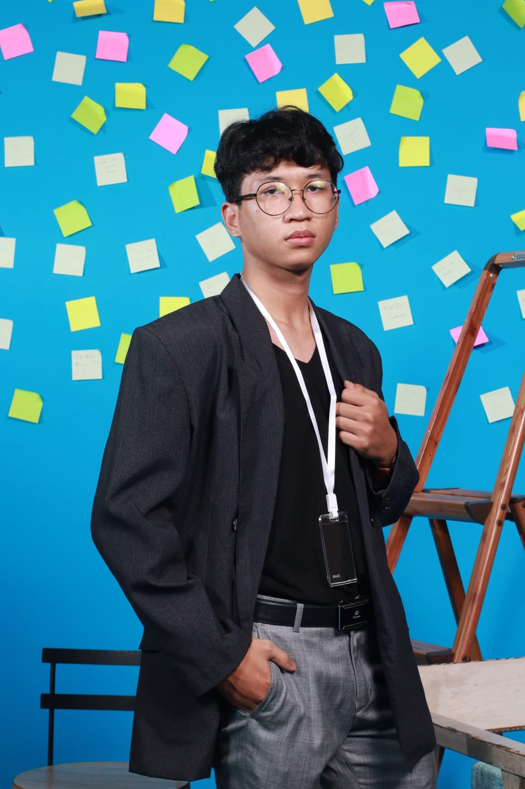

# Egbert Felica Wibianto Profile

Hi, perkenalkan nama saya Fika. Saya adalah salah satu peserta yang mengikuti course full stack dari Revou berasal dari team 6.

Isi dari blog ini adalah tentang perkenalan diri saya sendiri sehingga kita jadi mengenal satu sama lain. 

## About Me

Sebagai tahapan awal, perkenalkan sekali lagi saya Egbert Felica Wibianto biasa dipanggil Fika. Saya lahir di Bekasi pada tanggal 3 Desember 2005. Saat ini saya sedang berkuliah di Universitas Bakrie dengan mengambil program studi teknik informatika.

## Hobby

| Bermain game |  |
| ------------ | ---------------------------------------------------------------------- |
| Menonton anime |  |
| Membaca buku |  |
| Bermain basket |  |

## Goal

Tujuan saya mengikuti course full stack Revou adalah untuk menambah dan meningkatkan skill saya dalam dunia pemrograman sehingga dalam 6 bulan pembelajaran ini saya dapat mengerti algoritma dan penalaran dalam pemrograman dari dasar hingga ahli.

## Impression

Itulah akhir dari perkenalan diri saya, terima kasih karena telah meluangkan waktu dan membaca sampai akhir, saya sangat menghargainya. Saya akan menantikan jika ada yang ingin bertukar ide dengan saya bisa langsung contact saya. Akhir kata dari saya teruslah berusaha meskipun ditengah banyak errornya. Terima Kasih.

## Contact

IG : [@felicawibiantto](https://www.instagram.com/felicawibiantto/)

WA : 085799335009

Email : egbert.fewi@gmail.com

## Netlify

[Netlify](https://endearing-hotteok-309c8b.netlify.app/)