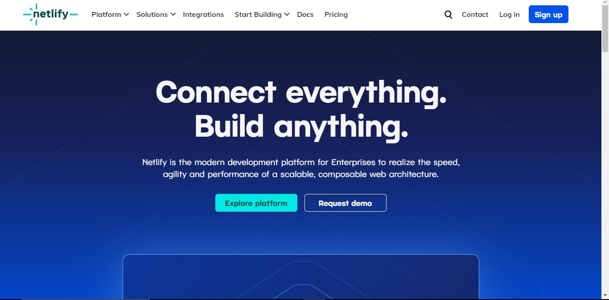
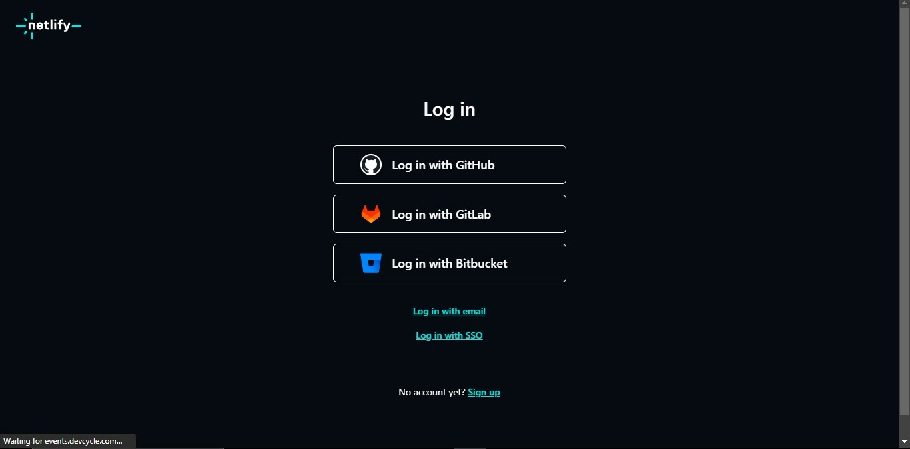

# Document How to Conect to Netlify

Langkah pertama buka di browser [Netlify](https://www.netlify.com/)

Lalu klik log in jika sudah mempunyai akun github

Setelah klik log in maka klik "log in with Github

Setelah log in berhasil maka akan muncul seperti tampilan diatas, lalu klik "domains" yang ada di bagian kiri

lalu klik "Add or register domain" yang ada di kanan atas

Setelah itu kita megikuti langkag-langkah yang telah diberikan yaitu dengan menuliskan domain yang ingin kita pakai dan menambahkan "DNS record" lalu tinggal menunggu aktifnya dari domain tersebut

Setelah berhasil maka tampilan yang akan muncul kurang lebih seperti ini

Jika ingin melihat apakah domain kita sudah terpasang dengan benar maka kita tinggal mengklik link yang ada disebelah kanan yang berada di dalam "DNS record"

# Domain

[domain](https://gamesplay.cloud/)