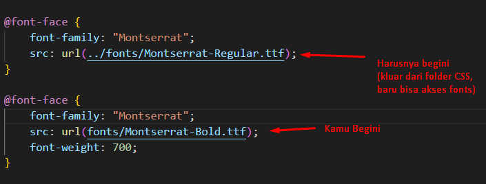
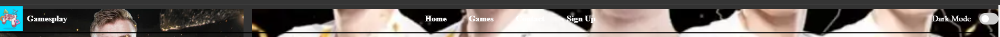
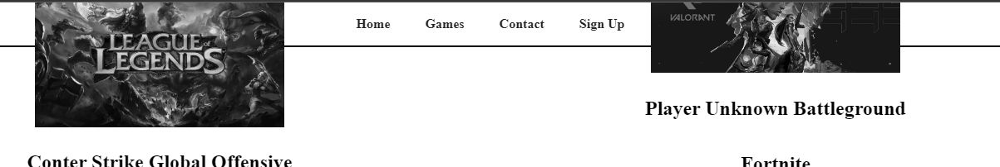
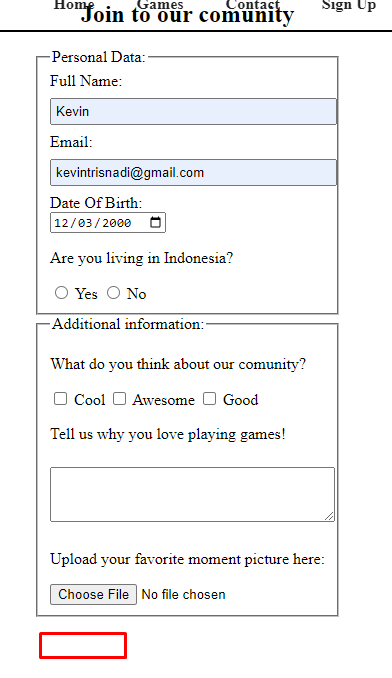
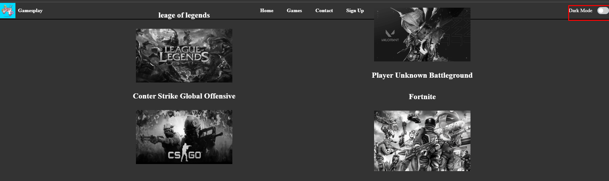
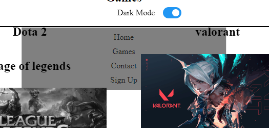

Menurut aku si fika udah oke. Aku suka kalo kamu udah usaha buat implement darkmode yang actually persistent dengan local storage. Secara layoutnya juga uda fully responsive, which is very good, dan untuk segi penilaian intermediate smuanya sudah terpenuhi dengan baik. tapi, menurut aku juga masi banyak yang perlu di improve:
1. Font face kamu masi belom pakai Montserrat, karena cara kamu pathing urlnya masih salah (lihat image)

2. Navbar kamu jangan transparan

3. Image kamu yang disini juga jangan timpa navbar

Ini kamu bisa fix dengan naikin Z Index navbarnya
4. Formnya juga tidak kelihatan submit buttonnya kalau diluar dark mode

5. button ini juga rada membingungkan, karena kliatannya dark modenya off tapi ternyata on

6. Dark modenya juga tidak persistent karena jika di refresh, website akan reset ke default. Ini berarti local storage implementation kamu belum bekerja dengan baik
7. Nav hamburgernya juga tertimpa dengan image kamu yang di games

Tolong diimprove terus ya Fika. Progressnya sudah ada keliatan, cuma mungkin karena kamu kurang waktu, jadi hasilnya kurang maksimal.